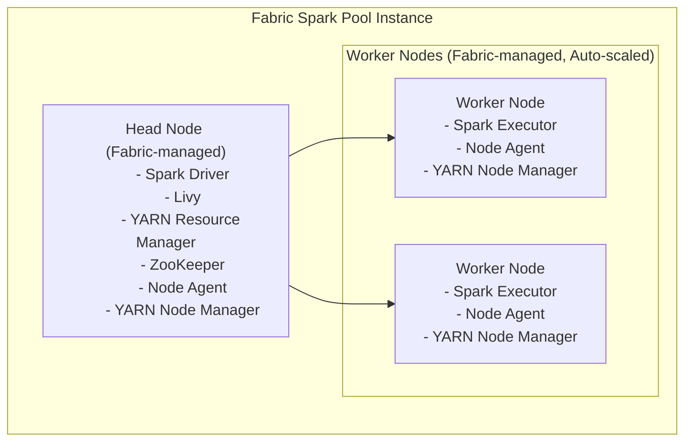
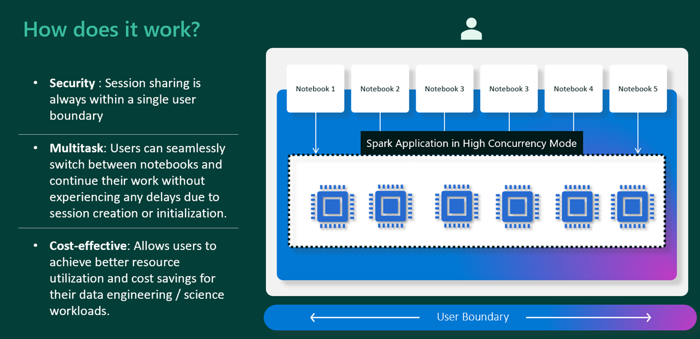
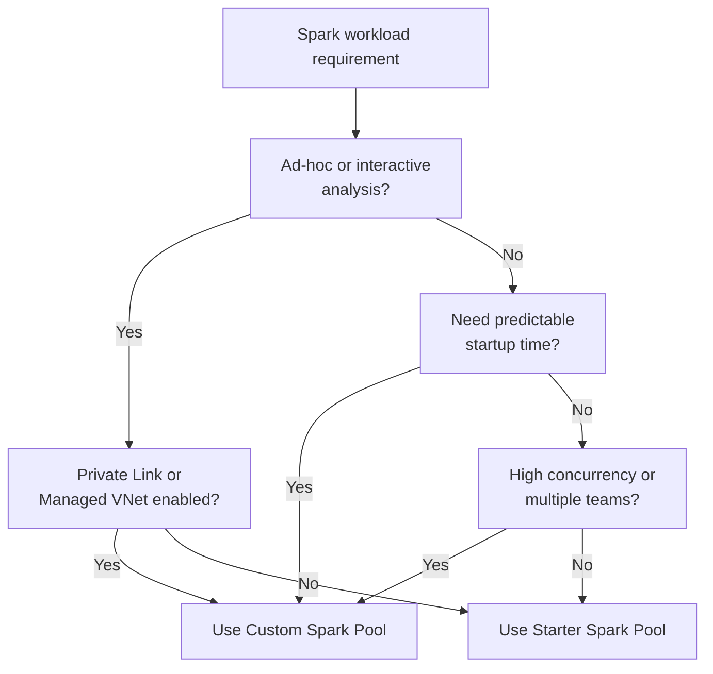
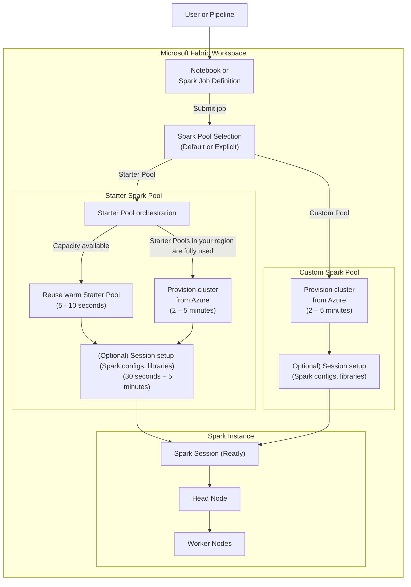

# Data Engineering - Spark

#fabric/de/spark

## Action Items

- #todo  Admin role: Create Spark Pools based on the workloads 
- #todo Member/Contribute role: Delegate Environment creation
- #todo Precreate Environment for Medallian Zones based on Resource Profiles
- #todo Update framework code to set the resource profiles by zone

## Anatomy of a Spark Instance

## Pool

### Starter Pool

- Only one starter pool per workspace, which is created by default
- Autoscale and Dynamic allocation cannot be disabled
- Can be near‑instant when warm (5 - 10 seconds) as nodes are borrowed from pre-warmed up pool (Fabric and Runtime ready) managed by Fabric
- Can fall back to on‑demand provisioning on certain scenarios
- Subject to regional availability and networking constraints (Not supported if Workspace is Private Link or Managed VNets enabled)

### Custom Pool

- Nodes are acquired on demand from Azure
- No “warm pool reuse” or regional exhaustion logic
- More predictable and consistent startup behavior than Starter Pools

> New custom pool creation do not allow you to set the Runtime version, libraries, spark configs, etc. These need to be set through **Environment** artifact. When not selected, the **Default Environment** (configured for Workspace) is used.

### Default Pool

- Is **not** a third type of pool alongside Starter Pool and Custom Pool. 
- Instead, it tells which pool Fabric will automatically use when you run Spark workloads and you haven’t explicitly chosen a pool
- Configurable per workspace
	- A _Starter Pool _can be set as the default pool
		- This is the usual setup for most workspaces
		- Fast startup, no cluster management, backed by Fabric-managed resources
	- A _Custom Pool_ can also be set as the default pool
		- Useful when you want all Spark workloads to use specific sizing, autoscaling, or configs by default

#### Why this matters

Choosing the right default pool:
	- Helps control cost and performance
	- Avoids accidental execution on an expensive pool
	- Ensures consistent runtime behavior across notebooks and jobs

### Key Takeaway

1. Starter Pools optimize for fast and bursty interactive workloads
2. Custom Pools optimize for predictable execution characteristics
3. Both provision compute on demand when needed

## Environment

While Pools define the hardware/physical (node family, node size, min/max nodes etc.) aspects of the cluster, Environments define the "software" (custom libraries, custom Spark Config, Spark/Fabric Runtime version) aspect of the cluster.

## Resource Profile

[Reference](https://learn.microsoft.com/en-us/fabric/data-engineering/configure-resource-profile-configurations)

- Pre-bundled (Property bag-based approach) set of configurations to optimize ETL, BI like workloads
- #fabric/spark/conf : `spark.fabric.resourceProfile`
- Four out-of-box profiles
	1. `writeHeavy`: High frequency ingestion
		- Use for Landing, Raw and Refined Zones
	2. `readHeavyForSpark`: Set for Spark workloads with frequent reads
		- Use for Certified Zone
	3. `readHeavyForBI`: Set for Power BI queries on Delta tables (Direct Lake mode)
		- Use for Certified and/or Extended-Certified or Purposed Zones
	4. `custom`
- #fabric/workspace/default All workspaces are defaulted to `writeHeavy`
- Can be configured through Environment or at runtime `spar.conf.set`

## High Concurrency Mode

High Concurrency Mode allows multiple notebooks to share a single Spark session. To make this possible without notebooks interfering with each other, Microsoft uses two key mechanisms: 

1. the Read-Eval-Print Loop (REPL): 
2. Virtual Core (vCore) assignment.

- Only applicable for Notebooks
- Session sharing is within a single user boundary
- Applicable for Custom Pools
- Only the initiating session that starts the shared Spark application is billed. All subsequent sessions that share the same Spark session do not incur additional billing 

### Summary

| Feature |	Role in High Concurrency |
|  --| --| 
| REPL Core	| Provides logical isolation so notebooks can share a session without variable naming conflicts.| 
| vCore Assignment	| Provides resource management and cost optimization, allowing 5 notebooks to share the same billed compute.| 

## Decision Tree

### Spark session startup flow

- Starter Pool advantage = possible reuse
- Custom Pool advantage = consistent behavior

## Reference

- [Performance - Optimized Write](https://milescole.dev/data-engineering/2024/08/16/A-Deep-Dive-into-Optimized-Write-in-Microsoft-Fabric.html)

