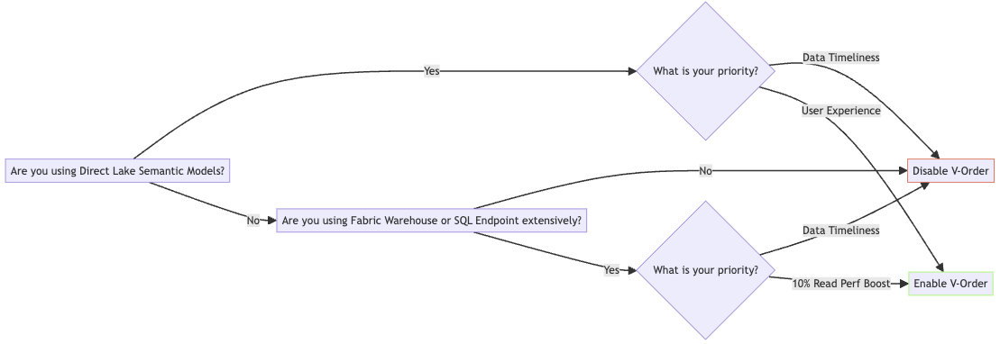
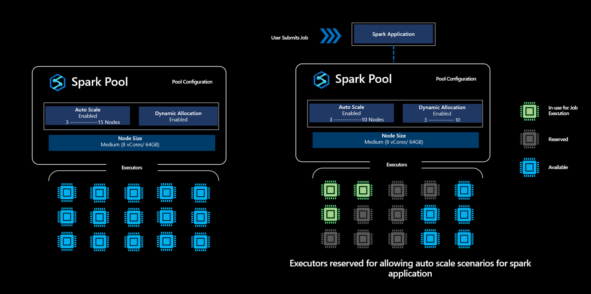
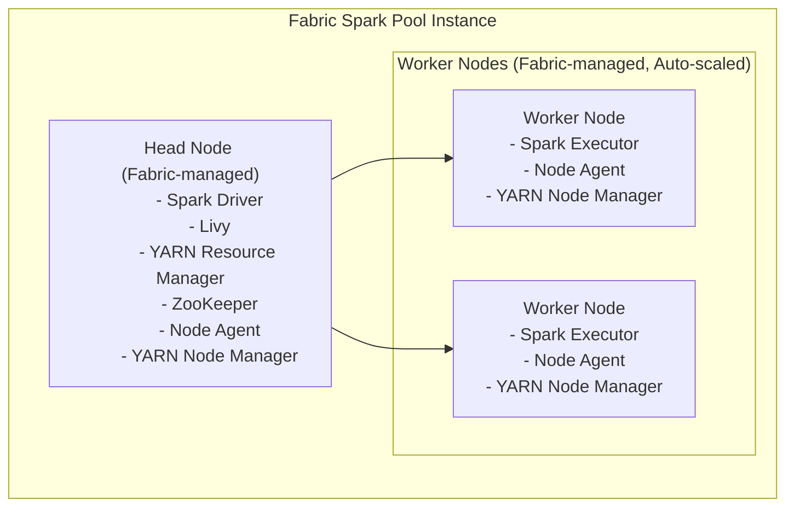
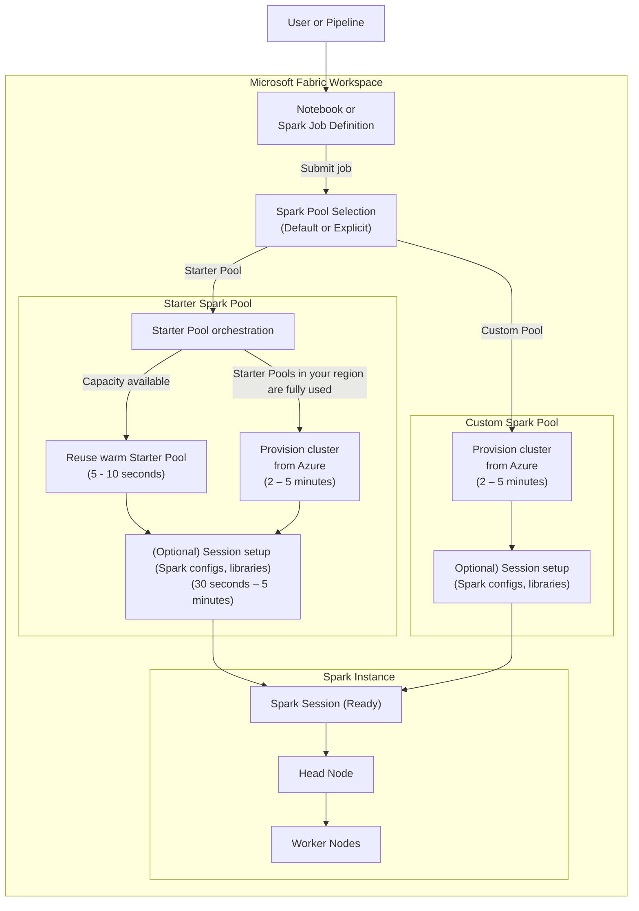
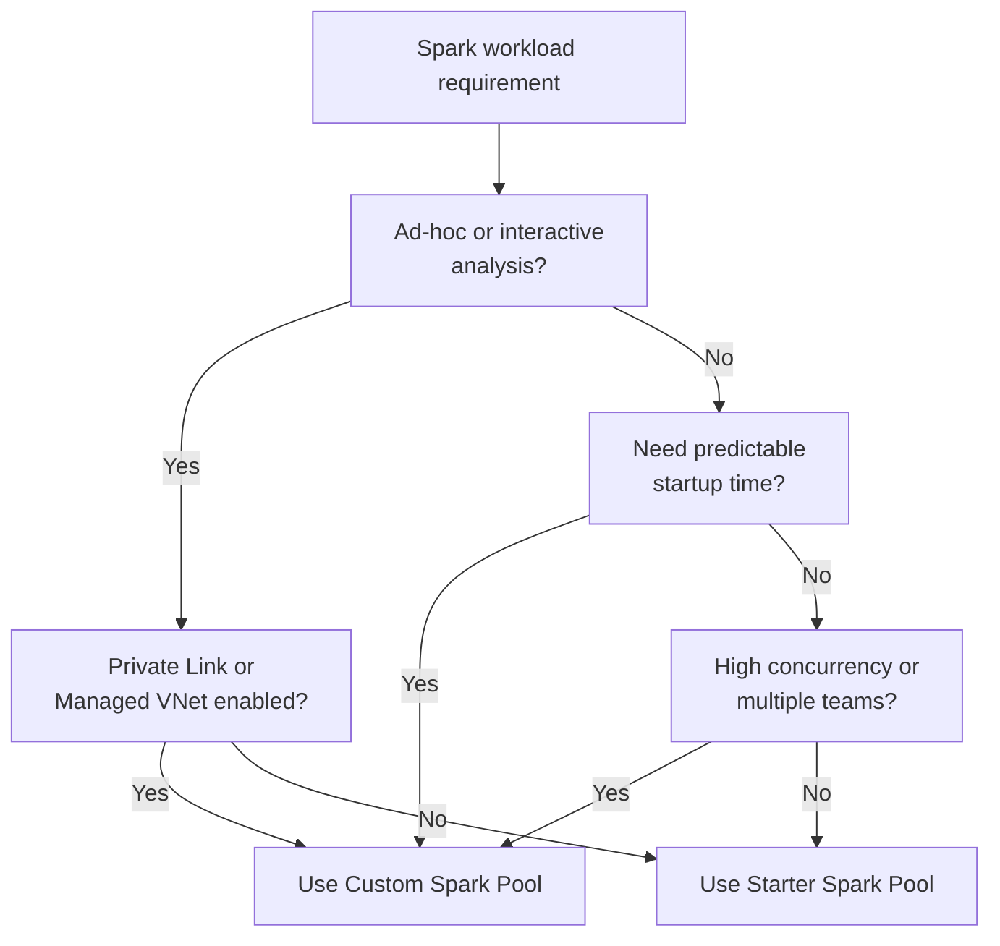

# README

Microsoft Fabric
#fabric

## Decision Tree

### Ingestion

[Reference](https://learn.microsoft.com/en-us/fabric/data-factory/decision-guide-data-integration)

[Reference](https://milescole.dev/data-engineering/2024/09/17/To-V-Order-or-Not.html)

### Transformation

- [Configure Auto Table Stats Collection](https://learn.microsoft.com/en-us/fabric/data-engineering/automated-table-statistics)
- [Adaptive Target File Size Mgmt](https://blog.fabric.microsoft.com/en-us/blog/adaptive-target-file-size-management-in-fabric-spark)
- [Optimized Write in Fabric](https://milescole.dev/data-engineering/2024/08/16/A-Deep-Dive-into-Optimized-Write-in-Microsoft-Fabric.html)

### Autoscal vs Dynamic Allocation

- Node: Nodes refer to the **physical** or virtual machines that provide the computational resources
- Executor: Executors are the **processes** that run on those nodes to execute tasks assigned by the Spark driver.
- In Fabric, there is a defined 1:1 elationship between nodes and executors. A Node will run only 1 executor. (In traditional Spark, a Node can host multipe executors).
- Autoscale manages the number of **nodes** based on **overall activity,** while dynamic allocation manages the number of **executors** based on the workload **demands of individual Spark applications**. Therefore, _dynamic allocation can function without autoscale being enabled,_ allowing Spark to adapt to workload changes by adjusting the number of executors as needed, even if the number of nodes remains constant.
- When Dynamic Allocation option is enabled, for every spark application submitted, **the system reserves executors during the job submission step based on the Max Nodes**, which were specified by the user to support successful auto scale scenarios.

## Data Engineering

### Anatomy of a Spark Instance

### Starter Pool

- Can be near‑instant when warm
- Can fall back to on‑demand provisioning on certain scenarios
- Subject to regional availability and networking constraints

### Custom Pool

- Nodes are acquired on demand from Azure
- No “warm pool reuse” or regional exhaustion logic
- More predictable and consistent startup behavior than Starter Pools

### Default Pool

- Is **not** a third type of pool alongside Starter Pool and Custom Pool. 
- Instead, it tells which pool Fabric will automatically use when you run Spark workloads and you haven’t explicitly chosen a pool
- Configurable per workspace
	- A _Starter Pool _can be set as the default pool
		- This is the usual setup for most workspaces
		- Fast startup, no cluster management, backed by Fabric-managed resources
	- A _Custom Pool_ can also be set as the default pool
		- Useful when you want all Spark workloads to use specific sizing, autoscaling, or configs by default

**Why this matters**

Choosing the right default pool:
	- Helps control cost and performance
	- Avoids accidental execution on an expensive pool
	- Ensures consistent runtime behavior across notebooks and jobs

https://milescole.dev/data-engineering/2024/08/22/Databricks-to-Fabric-Spark-Cluster-Deep-Dive.html

### Spark session startup flow

- Starter Pool advantage = possible reuse
- Custom Pool advantage = consistent behavior

### Key Takeaway

1. Starter Pools optimize for fast and bursty interactive workloads
2. Custom Pools optimize for predictable execution characteristics
3. Both provision compute on demand when needed

#### Decision Tree

## Tools

- [PBI Inspector](https://github.com/NatVanG/PBI-InspectorV2)
- [Python: Package, Distribute & Consume in Fabric](https://milescole.dev/data-engineering/2025/03/26/Packaging-Python-Libraries-Using-Microsoft-Fabric.html)