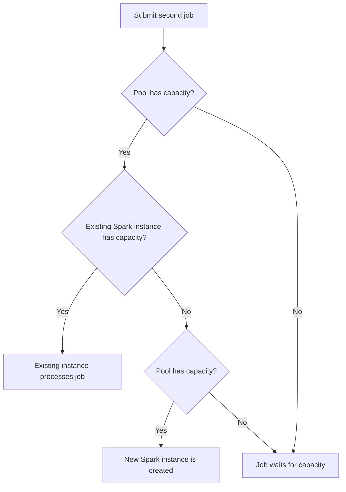

# README

#synapse/spark

## Pool vs Instance

- Pool is just metadata, a definition or a blueprint that encpasses node family, executor count, autoscale, TTL, custom spark conf etc.
- Instances are live and created when you connect to Spark, create a session and submit a job
	- Notebook
		- Multiple users can have access to the same pool (definition)
		- Each user gets a **new instance** when connected. So, when you define a Spark pool _you're effectively defining a quota per user for that pool_.
	- Spark Job Definition (SJD)
- Node types
	1. Head node: runs Livy, YARN RM, ZooKeeper & Spark Driver
	2. Worker node
- A Spark Instance has a minimum of 3 nodes ( 1 head node and 2 worker nodes)
- When #autoscale is disabled, the number of nodes set is fixed and those many nodes are created when a new Spark Instance is created.

> Elastic Pool Storage feature can be used to avoid "Out of Disk Space" errors. Spark jobs write shuffle map outputs, shuffle data and spilled data to local VM disks. Examples of operations that could utilize local disk are sort, cache, and persist.

### Example

- Spark Pool definiton: 20 nodes, no autoscalong. his means that all 20 nodes are available for processing jobs.
- J1 (Job 1) requires _**10**_ nodes (determined by YARN)
- When J1 is submitted, a new Spark Instance SI1 is created with _**20**_ nodes
- When job J1 is submitted, it utilizes 10 of those nodes, _while the remaining nodes can be allocated for other jobs_

### When is a new instance created?

## Dynamic Allocation

#spark/dynamic-allocation

- #synapse/autoscale enables (or accounts for) diverse workloads like data engineering, data exploration using notebooks, data science etc. So it is essentially at higher **workload level**
- dynamic allocation is finer-level i.e. **application level**
- Enable dynamic allocation of executors in scenarios where **the executor requirements are vastly different across stages of a Spark Job** or t**he volume of data processed fluctuates with time**. 
- For dynamic allocation, the platform **reserves** the number of executors based on the _maximum limit_ specified by the user for any spark application submitted.

## References

- [Apache Spark pool configurations in Azure Synapse Analytics](https://learn.microsoft.com/en-us/azure/synapse-analytics/spark/apache-spark-pool-configurations)
